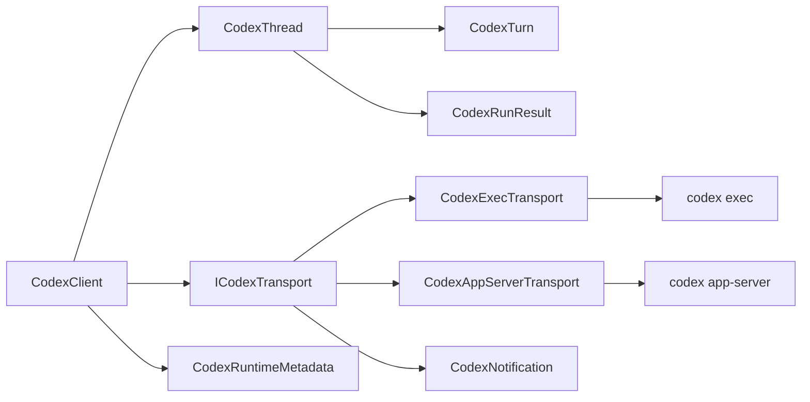

# ARC-CODEX-SDK-0001 - Codex .NET SDK Architecture and Dependency Injection Boundary

## Purpose

Describe how the Codex .NET SDK hangs together as a layered system that can speak to either the CLI-backed `codex exec` runtime or the app-server JSON-RPC v2 runtime while keeping the public API idiomatic in C#.

## Requirements Satisfied

- REQ-CODEX-SDK-0001
- REQ-CODEX-SDK-0002
- REQ-CODEX-SDK-0003
- REQ-CODEX-SDK-0004
- REQ-CODEX-SDK-0005
- REQ-CODEX-SDK-0006
- REQ-CODEX-SDK-0007
- REQ-CODEX-SDK-0008
- REQ-CODEX-SDK-0009
- REQ-CODEX-SDK-0010
- REQ-CODEX-SDK-0011
- REQ-CODEX-SDK-0012
- REQ-CODEX-SDK-0013
- REQ-CODEX-SDK-0014
- REQ-CODEX-SDK-0015
- REQ-CODEX-SDK-0016
- REQ-CODEX-SDK-0017
- REQ-CODEX-SDK-0018
- REQ-CODEX-SDK-0019
- REQ-CODEX-SDK-0020
- REQ-CODEX-SDK-0021
- REQ-CODEX-SDK-0022
- REQ-CODEX-SDK-0023
- REQ-CODEX-SDK-0030
- REQ-CODEX-SDK-0031
- REQ-CODEX-SDK-0032
- REQ-CODEX-SDK-0033
- REQ-CODEX-SDK-0034
- REQ-CODEX-SDK-0035
- REQ-CODEX-SDK-0036
- REQ-CODEX-SDK-0037
- REQ-CODEX-SDK-0038
- REQ-CODEX-SDK-0039
- REQ-CODEX-SDK-0040
- REQ-CODEX-SDK-0041
- REQ-CODEX-SDK-0042
- REQ-CODEX-SDK-0043
- REQ-CODEX-SDK-0044
- REQ-CODEX-SDK-0045
- REQ-CODEX-SDK-0046
- REQ-CODEX-SDK-0047
- REQ-CODEX-SDK-0048
- REQ-CODEX-SDK-0049
- REQ-CODEX-SDK-0050
- REQ-CODEX-SDK-0051
- REQ-CODEX-SDK-0100
- REQ-CODEX-SDK-0101
- REQ-CODEX-SDK-0102
- REQ-CODEX-SDK-0103
- REQ-CODEX-SDK-0104
- REQ-CODEX-SDK-0105
- REQ-CODEX-SDK-0106
- REQ-CODEX-SDK-API-0201
- REQ-CODEX-SDK-API-0202
- REQ-CODEX-SDK-API-0203
- REQ-CODEX-SDK-API-0204
- REQ-CODEX-SDK-API-0205
- REQ-CODEX-SDK-API-0206
- REQ-CODEX-SDK-API-0207
- REQ-CODEX-SDK-API-0208
- REQ-CODEX-SDK-API-0209
- REQ-CODEX-SDK-API-0210
- REQ-CODEX-SDK-API-0211
- REQ-CODEX-SDK-API-0212
- REQ-CODEX-SDK-API-0213
- REQ-CODEX-SDK-API-0214
- REQ-CODEX-SDK-API-0215
- REQ-CODEX-SDK-API-0216
- REQ-CODEX-SDK-API-0217
- REQ-CODEX-SDK-API-0218
- REQ-CODEX-SDK-API-0219
- REQ-CODEX-SDK-API-0220
- REQ-CODEX-SDK-CATALOG-0301
- REQ-CODEX-SDK-CATALOG-0302
- REQ-CODEX-SDK-CATALOG-0303
- REQ-CODEX-SDK-CATALOG-0304
- REQ-CODEX-SDK-CATALOG-0305
- REQ-CODEX-SDK-CATALOG-0306
- REQ-CODEX-SDK-CATALOG-0307
- REQ-CODEX-SDK-CATALOG-0308
- REQ-CODEX-SDK-CATALOG-0309
- REQ-CODEX-SDK-CATALOG-0310
- REQ-CODEX-SDK-CATALOG-0311
- REQ-CODEX-SDK-CATALOG-0312
- REQ-CODEX-SDK-DI-0260
- REQ-CODEX-SDK-DI-0261
- REQ-CODEX-SDK-DI-0262
- REQ-CODEX-SDK-DI-0263
- REQ-CODEX-SDK-DI-0264
- REQ-CODEX-SDK-DI-0265
- REQ-CODEX-SDK-DI-0266
- REQ-CODEX-SDK-DI-0267
- REQ-CODEX-SDK-DI-0268
- REQ-CODEX-SDK-DI-0269
- REQ-CODEX-SDK-DI-0270
- REQ-CODEX-SDK-HELPERS-0313
- REQ-CODEX-SDK-HELPERS-0314
- REQ-CODEX-SDK-HELPERS-0315
- REQ-CODEX-SDK-HELPERS-0316
- REQ-CODEX-SDK-HELPERS-0317
- REQ-CODEX-SDK-HELPERS-0318
- REQ-CODEX-SDK-HELPERS-0319
- REQ-CODEX-SDK-LIFECYCLE-0286
- REQ-CODEX-SDK-LIFECYCLE-0287
- REQ-CODEX-SDK-LIFECYCLE-0288
- REQ-CODEX-SDK-LIFECYCLE-0289
- REQ-CODEX-SDK-LIFECYCLE-0290
- REQ-CODEX-SDK-LIFECYCLE-0291
- REQ-CODEX-SDK-LIFECYCLE-0292
- REQ-CODEX-SDK-LIFECYCLE-0293
- REQ-CODEX-SDK-LIFECYCLE-0294
- REQ-CODEX-SDK-LIFECYCLE-0295
- REQ-CODEX-SDK-LIFECYCLE-0296
- REQ-CODEX-SDK-LIFECYCLE-0297
- REQ-CODEX-SDK-LIFECYCLE-0298
- REQ-CODEX-SDK-LIFECYCLE-0299
- REQ-CODEX-SDK-LIFECYCLE-0300
- REQ-CODEX-SDK-STRUCTURE-0271
- REQ-CODEX-SDK-STRUCTURE-0272
- REQ-CODEX-SDK-STRUCTURE-0273
- REQ-CODEX-SDK-STRUCTURE-0274
- REQ-CODEX-SDK-STRUCTURE-0275
- REQ-CODEX-SDK-STRUCTURE-0276
- REQ-CODEX-SDK-STRUCTURE-0277
- REQ-CODEX-SDK-STRUCTURE-0278
- REQ-CODEX-SDK-STRUCTURE-0279
- REQ-CODEX-SDK-STRUCTURE-0280
- REQ-CODEX-SDK-STRUCTURE-0281
- REQ-CODEX-SDK-STRUCTURE-0282
- REQ-CODEX-SDK-STRUCTURE-0283
- REQ-CODEX-SDK-STRUCTURE-0284
- REQ-CODEX-SDK-STRUCTURE-0285
- REQ-CODEX-SDK-TRANSPORT-0231
- REQ-CODEX-SDK-TRANSPORT-0232
- REQ-CODEX-SDK-TRANSPORT-0233
- REQ-CODEX-SDK-TRANSPORT-0234
- REQ-CODEX-SDK-TRANSPORT-0235
- REQ-CODEX-SDK-TRANSPORT-0236
- REQ-CODEX-SDK-TRANSPORT-0237
- REQ-CODEX-SDK-TRANSPORT-0238
- REQ-CODEX-SDK-TRANSPORT-0239
- REQ-CODEX-SDK-TRANSPORT-0240
- REQ-CODEX-SDK-TRANSPORT-0241
- REQ-CODEX-SDK-TRANSPORT-0242
- REQ-CODEX-SDK-TRANSPORT-0243
- REQ-CODEX-SDK-TRANSPORT-0244
- REQ-CODEX-SDK-TRANSPORT-0245
- REQ-CODEX-SDK-TRANSPORT-0246
- REQ-CODEX-SDK-TRANSPORT-0247
- REQ-CODEX-SDK-TRANSPORT-0248
- REQ-CODEX-SDK-TRANSPORT-0249
- REQ-CODEX-SDK-TRANSPORT-0250

## Design Summary

The SDK should center on a single stateful `CodexClient` façade that owns runtime selection, metadata, disposal, and capability discovery.

That façade should build `CodexThread` and `CodexTurn` live handles on top of a shared transport abstraction.

The transport abstraction should have two concrete backends:

- `CodexExecTransport` for the CLI-backed, process-per-run execution model
- `CodexAppServerTransport` for the persistent JSON-RPC stdio execution model

The user-facing `CodexThread` abstraction should be stateful in both cases, even though the underlying runtime may be stateless in exec mode and stateful in app-server mode.

The DI story should live in a separate optional package so the core SDK can be used directly without `IServiceCollection`.

## Key Components

- `CodexClient`
- `CodexThread`
- `CodexTurn`
- `CodexClientOptions`
- `CodexThreadOptions`
- `CodexTurnOptions`
- `ICodexTransport`
- `CodexExecTransport`
- `CodexAppServerTransport`
- `CodexRuntimeCapabilities`
- `CodexRuntimeMetadata`
- `CodexApprovalHandler`
- `CodexNotificationRouter`
- `CodexSchemaFileFactory`
- `CodexServiceCollectionExtensions`

## Data and State Considerations

`CodexClient` is stateful because it owns a runtime process or connection, a metadata snapshot, and the active transport.

`CodexThread` is also stateful because it keeps the current thread identity, the conversation history in exec mode, or the remote thread id in app-server mode.

`CodexTurn` is ephemeral and single-consumer. The stream returned from `StreamAsync` should own the active consumer slot until it completes, faults, or is disposed.

Options, results, event payloads, and item payloads should remain immutable so they can be passed across layers without accidental mutation.

The CLI backend should be treated as process-per-run and therefore closer to a stateless transport adapter.

The app-server backend should be treated as a persistent JSON-RPC session with a single stdio reader and writer.

## Edge Cases and Constraints

- Unsupported backend methods should fail with a capability exception rather than returning a fabricated result.
- Temporary output-schema files should be removed on success, cancellation, and failure.
- A second active turn consumer on the same client instance should be rejected deterministically.
- Environment handling should remain backend-specific so the CLI path can isolate process variables while the app-server path can overlay them.
- The final-response selection rule should prefer `final_answer` phase messages before falling back to phase-less assistant messages, and commentary-only turns should produce no final response.

## Alternatives Considered

- Separate public `CodexCliClient` and `CodexAppServerClient` classes.
  - Rejected because it fragments the user-facing API and makes thread handling look different even when the conversation semantics are shared.
- Build on the official OpenAI .NET library.
  - Rejected because Codex runtime operations are mediated by the Codex binary and app-server protocol, not by direct OpenAI API calls.
- Expose only a raw protocol client.
  - Rejected because that would force C# consumers to reimplement idiomatic conversation wrappers, result reduction, and state handling.

## Risks

- The CLI and app-server backends will continue to diverge in available features, so capability gating must stay explicit.
- Derived artifact drift could break the public surface or validation gate if the checked-in snapshots are not refreshed in lockstep.
- State management bugs are likely if `CodexThread` and `CodexTurn` are allowed to be used concurrently without strict gates.

## Open Questions

- None. The companion requirements now fix the namespace split, backend defaults, construction model, and protocol visibility rules.
